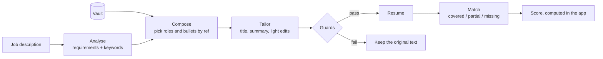
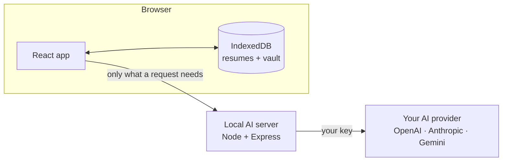

# resume-tool

A small app I built over a weekend to stop rewriting my resume for every job. It keeps every bullet I've written in one place (the vault), and when I paste a job description it puts together a resume for that job from them, then shows how well it matches. It runs on your laptop and your resumes stay in your browser.


[Quickstart](#quickstart) · [Features](#features) · [How the AI works](#how-the-ai-works-and-where-its-allowed-to-fail) · [Architecture](#architecture) · [Roadmap](#roadmap) · [Contributing](CONTRIBUTING.md)

## Why

Tailoring a resume for every application is the advice everyone gives and nobody has time for, and the AI tools for it tend to make things up. So a few rules I stuck to:

1. **Your history is the source.** Every bullet you've written, across every version, lives in one vault, without duplicates. Tailored resumes are put together from it, never invented.
2. **AI suggests, it doesn't invent.** Rewrites keep your facts and numbers, and the server rejects edits that don't. Missing metrics become `[X]` placeholders for you to fill.
3. **A score you can check.** The job match is calculated from requirements covered, keywords and title fit, and shown piece by piece, not a number an LLM made up.
4. **Runs locally, bring your own AI.** No account, no cloud database. A small local server holds your key and talks to OpenAI, Anthropic or Gemini only when you ask.

## Quickstart

You need **Node.js 22+**, **git**, and Chrome (or Chromium, Edge, Brave) for one-click PDFs. One line installs and starts everything:

```bash
curl -fsSL https://raw.githubusercontent.com/abhishek17r/resume-builder/main/install.sh | sh
```

Then open **http://localhost:5190** and go to **Integrations** to connect your own AI. Every AI feature goes through the provider you connect there:

| Provider | What you need |
|---|---|
| OpenAI, Anthropic, Google Gemini | Your API key |
| OpenRouter, Groq, Ollama, any OpenAI-compatible API | Coming soon |

Test the connection, pick a model, and switch providers any time without restarting. Keys are saved by the local AI server on your computer (`api/.data/`, readable only by your user) and never stored in the browser. Until you connect one, the editor, designs, vault and quality checks all work; AI features say they need a connection.

<details>
<summary>Manual install</summary>

```bash
mkdir resume-tool && cd resume-tool
git clone https://github.com/abhishek17r/resume-builder.git app
git clone https://github.com/abhishek17r/resume-builder-api.git api
(cd api && npm install)
cd app && npm install
npm run dev        # starts the app on :5190 and the AI server on :8787
```

`npm run dev` finds the AI server next to the app (`../api`, `../resume-tool-api` or `../resume-builder-api`) and starts it too; `npm run dev:app` starts the app alone. If the server runs elsewhere, set `VITE_API_URL`.
</details>

## Features

**Vault: your career in one place**
- Built automatically from every resume you create or import; edit it freely and it keeps your edits.
- Deduplicated: the same bullet across versions is one entry with all its sources. A changed metric or a real rewrite keeps its own copy.
- Organised by company, role, project, education and skill, and by **your own tags** (Leadership, Cross-functional, Revenue & cost…). Tags are added automatically when your bullets or target jobs show a theme; add your own, or let AI suggest more.
- Every bullet is scored for impact and clarity, with one-click fixes and honest rewrites.
- Your profile (contact details, headlines) lives here too.

**Tailor to a job**
- Paste a job description: the job is analysed, your most relevant roles and bullets are chosen (every company stays in), and the title, summary, skills and bullets are lightly reworded in the job's terms, with every change listed.
- A **match score** you can read: requirements covered (must-haves weigh 3×), job keywords found, title fit.
- Tracked-change suggestions to push the match further, and "from your vault" picks for bullets you've written elsewhere.

**Write and design**
- Section editor with rich-text bullets, drag and drop, hidden entries, and quality markers from the checks.
- Ten distinct templates, type pairings, density presets and **fit to one page**, plus fine control of every font, size, colour and spacing. Your last design becomes the default for new resumes.
- A paginated preview, and **Download PDF** saves `Name_Resume_ddmmyyyy(n).pdf` straight to your downloads, exactly as shown.

**Import**
- PDF, Word, text/Markdown, JSON backups, and LinkedIn (profile PDF or data export). Text, layout and design are read separately; choose a template or keep the original look.

## How the AI works (and where it's allowed to fail)

Every AI feature is a single structured call with a JSON schema: no chat, no agents. The server checks what comes back before the app sees it.



| Risk | Guard |
|---|---|
| Invented facts or numbers in a rewritten bullet | Rejected unless every number matches the original, the length stays within ~20% and most words are kept; no `[X]` placeholders when tailoring |
| A summary with made-up metrics | Every number must appear in your own material, or your original summary is kept |
| Skills you don't have | Only skills you listed or that your bullets show |
| Picking content that doesn't exist | Composition returns references only; unknown or mismatched references are dropped |
| A score that drifts between runs | The AI only labels each requirement; the number is computed deterministically from those labels plus exact keyword and title matches |

Without a connected provider, AI endpoints return a clear "not connected" error and the app points you to Integrations. For development, `MOCK=1` runs the server in a keyword-heuristic demo mode.

## Architecture



- **App** (this repo): React 19, Vite, Tailwind, zustand. Custom paginated renderer; importers built on pdf.js and mammoth.
- **AI server** ([resume-builder-api](https://github.com/abhishek17r/resume-builder-api)): Express 5, Zod schemas shared across providers, prompt caching, rate limits, CORS locked to the app.

```
src/
  components/     UI: editor, design, optimise, vault, landing
  lib/import/     PDF / DOCX / LinkedIn readers
  lib/optimize/   quality rules, job-match score
  lib/vault/      sync, dedupe, tags, compose, scoring
  config/         app name, tag library
scripts/          dev launcher, demo GIF recorder
```

## Roadmap

- **Evals:** a public suite for honesty, edit fidelity, bullet selection, score stability and import accuracy, run on every prompt or model change.
- **Token economics:** cost and latency per feature, shown in the app.
- **Observability:** a local trace of every AI call, its guards and timing.
- **MCP server:** edit and style your resume from Claude, live in the preview.
- **Application tracker:** from job description to offer.

## Contributing

Issues and pull requests are welcome; see [CONTRIBUTING.md](CONTRIBUTING.md). Contributions are accepted under the [CLA](CLA.md).

## Licence

[AGPL-3.0](LICENSE) © Abhishek Ranjan. You can use, modify and self-host resume-tool freely; if you offer a modified version as a network service, you must share its source under the same licence.
